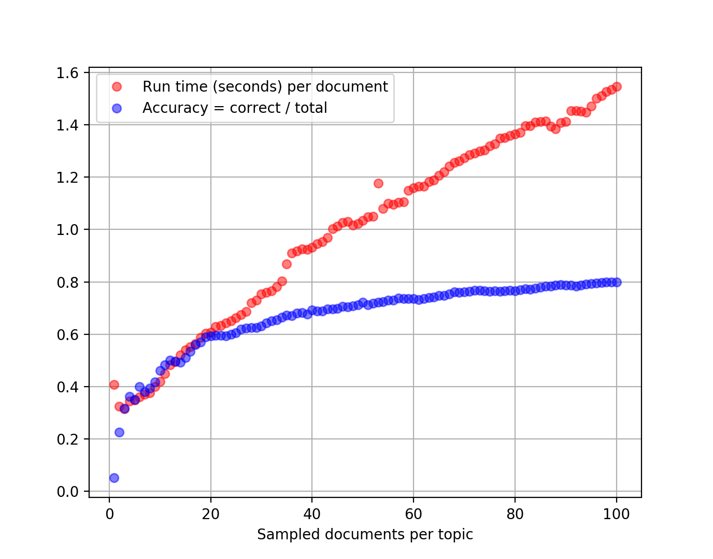

# Evaluation results
Inital evaluation performed by Max Orhai at Galois, May 2017.

## Method
On a MacBook Pro I timed and ran the submitted solution 100 times, with training sets ranging from 1 to 100 documents per topic.
The captured output was [scored](score.py) for accuracy.
The scores and timing are summarized in a [CSV](scores.csv).

## Accuracy
The classifier performs well, attaining 60% accuracy after only 20 sampled documents per topic, and approaching 80% when given more training data.

The animation below shows the improvement as the size of the training set ranges from 1 to 100 documents for each of the 20 newsgroups.

## Performance
As expected, run times are quadratic in the input size.
The plot below shows the (dimensionless) proportion of correctly classified documents along with the number of seconds *per document*, so it appears linear.

